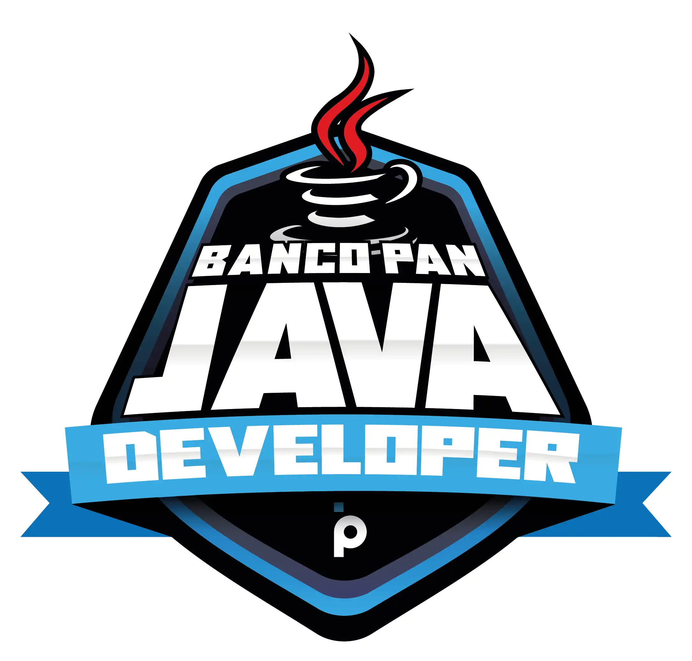

# Desafio de Projeto da DIO - Git/Github

   

## 
 Eai Beleza!  

Nesse desafio, fomos desafiados pelo prof **Venolton Falvo Jr**, perante nosso conhecimento, para realizarmos um repositório com nossas anotações das aulas que tivemos até agora da **plataforma DIO**, no bootcamp promivido pelo "**Banco PAN**", criando um repositório com essas informações lá, em forma de termos elas para visualização, conforme um caderno digital. Ex: Onenote do Windows.
##  git status | git add *arquivos | git commit -m "mensagem" | git push origin master (main)

1. Criação de repositório pelo propio Github;

2. Ativando Git com comando "git init";

3. Realizando todas as alterações nos documentos pelo editor de texto Markdown (MarkText);

4. Criação de um documento READ.ME para "capa do desafio".

5. Realizando envio por meio de "command line" para o Github;

## Desafio DIO

Este projeto é um desafio proposto na plataforma Digital Inovation One
## Links Úteis

[Sintaxe Basica Markdown](https://www.markdownguide.org/basic-syntax/) 

[Bootcamp Banco PAN Java Developer](https://web.dio.me/track/banco-pan-java-developer)